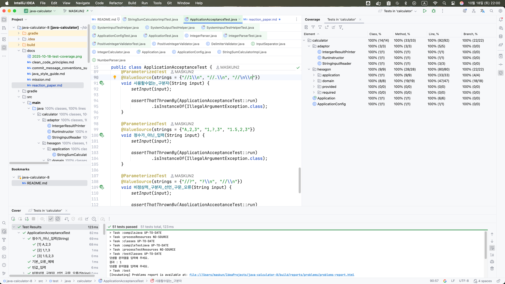

회고 / 소감문
---
**어떻게 작성할 것인가?**
> @네오 : 과제를 제출할 때는 미션을 진행하며 느낀 점을 소감문에 작성해 주세요.
> 단순한 결과보다, 학습 과정에서의 시도와 배움이 드러나도록 써 주세요.

- 테스트 코드를 좀 열심히 쓰고 체계적으로 해보려고 노력했다.
- 처음부터 미션에 있는 링크를 수집하고 이를 미리 읽고 정리하려고 노력했다. 앞으로도 계속 미션을 수행하면서 몸에 익혀야하므로 나를 위해서 간추릴 필요가 있었다.

---
**왜 기능단위 커밋을 할까?**
> Git의 커밋 단위는 앞 단계에서 README.md에 정리한 기능 목록 단위로 추가한다.

- `과제 진행요구사항` 중 위 내용이 조금 혼란스러웠다. 처음엔 "커밋은 오직 기능 목록의 카테고리에 한정한다"는 의미라고 생각되었다. 하지만 함께
  제공된 [커밋 메세지 컨벤션](commit_message_conventions_summary.md)에서 docs, refactor 등의 타입이 허용되고 있고 README.md 파일을 수정하는 커밋은
  분명 docs 타입이기 때문에 이는 허용될 것이라고 판단했다.
- 또한 반대로 왜 `과제 진행요구사항`에서 "기능 목록 단위"로 커밋을 하도록 요구하는지를 고객(평가자/스탭, 리뷰어/동료)입장에서 생각해보았다. 다음과 같은 이유가 아닐까 생각해보았다.
    - **변경의 단위 분리(원자화)** : 만약 둘 이상의 기능의 수정하여 하나의 커밋에 둔다면 나중에 둘중 하나의 오류가 전체 커밋에 영향을 준다. 만약 커밋을 amend하거나 하는 상황에서 복잡성이
      초래되므로 이는 피해야한다.
    - **한번에 하나의 맥락을 포함한다** : 둘 이상의 기능 개발을 하나의 커밋으로 올린다면 동시에 두개의 맥락(Context)가 있다. 이러면 읽어야할 코드가 복잡해져서 리뷰어는 읽기가 어렵다. 또한
      커밋메세지에 두개의 변경을 모두 담아야하므로 구별하기 어렵다.
    - **기능은 구체적인 작업을 묶어 추상화한다(일이 아니라 의도 드러내기)** : 만약 어느 작업이 있고 이 작업을 설명하기 위해 "전달된 int 인자에 % 연산자와 2를 대입하여 나온 값이 1인지 0 인지에
      따라 논리값을 반환하는 작업" 이라고 설명한다면 리뷰어는 전혀 이해하지 못할 것이다. 사실 이것은 다음과 같은 간단히 추상화된다. "짝수인지 구별하는 기능" 이제 리뷰어는 쉽게 이해할 수 있을 것이다.
      만약 기능이 잘 정리되어 있다면 같이 일하는 동료도 적은 비용으로 개발업무에 대해서 의사소통이 가능해진다.
    - **기능은 색인된다(히스토리 추적 및 유지보수)** : 우리가 기능을 잘 도출한다면 기능 단위의 수정, 확장 작업이 이뤄진다. 큰 변화가 없는 한 앞으로도 해당 기능을 경계 안에서 변경이 이뤄질 것으로
      기대할 수 있다. 이는 평가자들이 해당 기능의 변천을 커밋로그로 추척하기 쉬운 환경을 제공할 것이다.
- 정리하자면 기능단위의 커밋은 개발의 유연성을 높이고 동료와 평가자/리뷰어에게 보다 쉽게 읽히는 커밋히스토리를 제공할 수 있을 것으로 기대했다.

---
**기능(function)과 기능(feature)을 구분하기**

- 처음 기능 목록을 작성할때 "어떤 인자를 받고 어떤 값을 전달해야하는지" 등을 기술하며 지나치게 디테일하게 작성하게 되었다.
- 나중에 내가 작성한게 기능(feature)이 아니라 기능(function)이었음을 알게되었다.
- 요약하자면 다음과 같다.
    - 기능 (Feature): 사용자 관점의 가치(Value) 있는 작업 또는 사용자 경험.'누가(Who)' '무엇을(What)' '왜(Why)' 하는지에 초점을 맞춘 **고수준(High-Level)**의
      설명. (e.g., 사용자는 신용카드로 결제할 수 있다.)
    - 기능 (Function): 개발자 관점의 기술적 구현 단위. **'어떤 인자를 받고', '어떤 값을 반환하며', '내부에서 어떤 로직을 수행하는지'**에 대한 **저수준(Low-Level)**의 디테일.
- 이후 이 분류를 체득하는데 시간이 들었고 기존 기능 목록을 지우고 처음부터 다시 작성하였다.
- 기능 (Feature)을 작성하며 너무 지나치게 추상화되지 않고 각 단위마다 커밋이 가능한 레벨로 작성했다. 

---
**기본 구현 camp.nextstep.edu.missionutils.test.NsTest 에 대한 의문**

```java
    private void command(final String... args) {
    final byte[] buf = String.join("\n", args).getBytes();
    System.setIn(new ByteArrayInputStream(buf));
}
```

- 해당 클래스의 command 메서드는 사용자의 입력을 모사하는 기능이다.
- camp.nextstep.edu.missionutils.Console 의 readLine() 은 내부적으로 java.util.Scanner의 nextLine()메서드를 사용한다.
- 만약 NsTest.command("") 와 같이 빈문자열 하나가 인자로 전달되면 Console.readLine()은 NoSuchElementException을 던지게 된다.
- 왜냐면 Scanner는 내부적으로 입력스트림이 닫혀있는 경우(스트림 길이가 0에도 해당) NoSuchElementException 을 던지기 때문이다.
- 하지만 실제 사용자가 콘솔에 입력을 하는 상황은 ""와 같이 빈문자가 전달되지 않는다. 엔터를 눌러 전송하기 때문에 반드시 입력문자열끝에 개행문자"\n"이 추가되게 된다.
- 즉 NsTest.command("")는 실제 사용자의 입력을 모사하지 못한다.
- 이점은 빈문자열이 전송되는 테스트를 구상하는데 조금 어려운 점이었다. 요구사항에는 다음과 같이 적혀있다.

> 기능 요구 사항
> 입력한 문자열에서 숫자를 추출하여 더하는 계산기를 구현한다.
> 쉼표(,) 또는 콜론(:)을 구분자로 가지는 문자열을 전달하는 경우 구분자를 기준으로 분리한 각 숫자의 합을 반환한다.
> 예: "" => 0, "1,2" => 3, "1,2,3" => 6, "1,2:3" => 6

- 즉 예시의 첫번째 사례인 `"" => 0` 은 NsTest.command("")를 통해서는 정상적으로 재현할 수 없다.
- 따라서 나는 Console.readLine() 에서 NoSuchElementException 생겼을 때에 예외를 복구처리하여 ""을 대신 리턴하도록 설계하였다.

---
**TDD와 인수테스트(AcceptanceTest)**


- 이전 직장에서 개발을 할때는 레거시 코드에 테스트 코드가 거의 없다 싶이 해서 많은 고초를 겪었던 기억이 난다.
- 사수가 없는 상태에서 나혼자 배운 테스트 코드를 작성하며 무척 힘들었다.
- 우선 도메인 지식이 없어 케이스를 세분화하기가 무척 어려웠고 입출력도 제각각이라 통일성있게 가져가기도 어려웠다.
- 그러다보니 조금 빠르게 어느정도 API 엔드 포인트의 해피케이스만이라도 인수테스트를 작성했다.
- 통합테스트로 실제 웹환경에서 검증하기 위한 RestAssured와 픽스쳐 생성을 위한 Instancio를 정말 정말 많이 사용했던 기억이 난다.
- 퇴직 하고 든 생각은 "아, 내가 인수테스트는 했지만 유닛테스트와 TDD를 하지 못했구나"였다.
- 인수테스트로 급한 불은 껏지만 간헐적으로 기존 예전 코드들이 국지적으로 말썽을 피웠다.
- 이는 복리효과처럼 나중에 더 큰 문제로 다가왔다.
- 이번 프리코스에서 나는 TDD와 단위테스트를 적극적으로 하려고 노력했다. 이번 연습을 통해서 전문 TDD 개발자가 되도록(?) 훈련해보는 것이 목적이었다.
- 기능을 유려하게 잘뽑도록 노력했고 예외처리에 대한 내용도 기능에 최대한 넣었다. 각 기능마다 독립적인 유닛테스트를 작성할 수 있도록 코딩했다.
- 유명 개발자 백명석님의 클린코더스 강의 중에 TDD라이브 코딩하는 것이 있는데 이것을 참고해서 똑같이 처음부터 /test/ 경로로 들어가서 바로 테스트를 작성하고 실패, 성공, 리팩토링을 거쳤다.
- 중간부터는 몸에 익는지 정말 빠르게 테스트코드를 작성할 수 있었다.
- 느끼는 것이지만 테스트 코드를 빠르게 작성하는 것은 단순히 기술을 알거나 하는게 아니라 요구사항과 기능명세가 잘 이뤄져야 가능하다는 사실을 알게 되었다.
- 요구사항을 알고 기능이 세분화되면 그자리에서 바로 유닛 테스트 케이스가 나오고 그것으로 실패를 하고나서 성공을 하기 위해 /main/ 경로에가서 코딩을 하는 것을 알았다.
- 정말 중요한 것은 코딩하기 전이라는 사실을 알게된 것 같아 좋았다.
- 이후 통합 인수 테스트도 작성했다. camp.nextstep.edu.missionutils.test.NsTest 를 상속한 기 작성된 테스트는 그대로 두고 인수 테스트용 테스트 케이스를 리드미에 작성하였고
- 해당 테스트 케이스도 깔끔하게 성공하게 되었다.
- 종합적으로 전체 테스트 커버리지가 100%가 찍히는 것을 보고 무척 기뻤다. 초반은 무척 힘들었고 중반까지 진도가 잘 안나갔지만 중반부터는 쭉쭉 나갈 수 있었다.
- 다음에는 더 빠르게 더 견고하게 할 수 있겠지.
- 이제 남은 것은 리팩토링이다!


