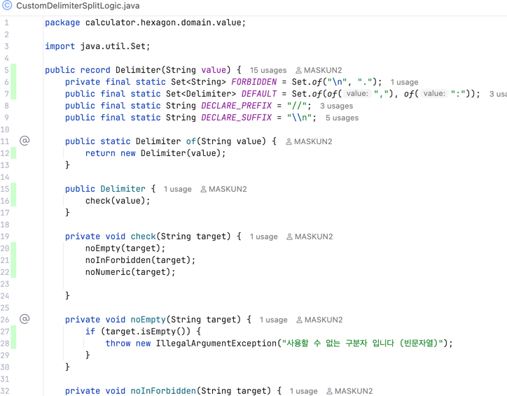

회고 / 소감문
---
**어떻게 시작했을까?**

- 난 TDD를 막연히 알고만 있었고 실제 프로젝트에서 해본적이 없었다. 그래서 직접 해보고 싶었다. 그렇게 좋다는데 나도 알고 싶었다.
- 문서가 문저 눈에 들어왔고 처음부터 미션에 있는 링크를 통해서 코딩, 컨벤션 가이드를 수집하고 미리 저장했다.
- 빠르게 코딩하는 것보다 먼저 이 문서를 읽고 천천히 음미하도록 노력했다.
- 이런 문서들은 앞으로도 계속 몸에 익혀야하므로 나를 위해서 정리하여 저장했다.
- 그리고 천천히 기능에 대한 분류와 TDD를 하기 위한 방법을 고민했다.
- 이 과정은 처음에 무척 길고 어렵고 막막하고 지루하게 느껴졌지만 점차 속력이 붙었고 체화되기 시작했다.
- 그 과정에서 깨닫는 것들이 있었고 이것을 잊지 않도록 코딩을 하면서도 수시로 소감을 작성하려고 했다.

---
**왜 기능단위 커밋을 할까?**
> Git의 커밋 단위는 앞 단계에서 README.md에 정리한 기능 목록 단위로 추가한다.

- `과제 진행요구사항` 중 위 내용이 조금 혼란스러웠다. 처음엔 "커밋은 오직 기능 목록의 카테고리에 한정한다"는 의미라고 생각되었다. 하지만 함께
  제공된 [커밋 메세지 컨벤션](commit_message_conventions_summary.md)에서 docs, refactor 등의 타입이 허용되고 있고 README.md 파일을 수정하는 커밋은
  분명 docs 타입이기 때문에 이는 허용될 것이라고 판단했다.
- 또한 반대로 왜 `과제 진행요구사항`에서 "기능 목록 단위"로 커밋을 하도록 요구하는지를 고객(평가자/스탭, 리뷰어/동료)입장에서 생각해보았다. 다음과 같은 이유가 아닐까 생각해보았다.
    - **변경의 단위 분리(원자화)** : 만약 둘 이상의 기능의 수정하여 하나의 커밋에 둔다면 나중에 둘중 하나의 오류가 전체 커밋에 영향을 준다. 만약 커밋을 amend하거나 하는 상황에서 복잡성이
      초래되므로 이는 피해야한다.
    - **한번에 하나의 맥락을 포함한다** : 둘 이상의 기능 개발을 하나의 커밋으로 올린다면 동시에 두개의 맥락(Context)가 있다. 이러면 읽어야할 코드가 복잡해져서 리뷰어는 읽기가 어렵다. 또한
      커밋메세지에 두개의 변경을 모두 담아야하므로 구별하기 어렵다.
    - **기능은 구체적인 작업을 묶어 추상화한다(일이 아니라 의도 드러내기)** : 만약 어느 작업이 있고 이 작업을 설명하기 위해 "전달된 int 인자에 % 연산자와 2를 대입하여 나온 값이 1인지 0 인지에
      따라 논리값을 반환하는 작업" 이라고 설명한다면 리뷰어는 전혀 이해하지 못할 것이다. 사실 이것은 다음과 같은 간단히 추상화된다. "짝수인지 구별하는 기능" 이제 리뷰어는 쉽게 이해할 수 있을 것이다.
      만약 기능이 잘 정리되어 있다면 같이 일하는 동료도 적은 비용으로 개발업무에 대해서 의사소통이 가능해진다.
    - **기능은 색인된다(추적 및 유지보수)** : 우리가 기능을 잘 도출한다면 기능 단위의 수정, 확장 작업이 이뤄진다. 큰 변화가 없는 한 앞으로도 해당 기능을 경계 안에서 변경이 이뤄질 것으로
      기대할 수 있다. 이는 평가자들이 해당 기능의 변천을 추적하기 쉬운 기반을 제공할 것이다.
- 정리하자면 기능단위의 커밋은 개발의 유연성을 높이고 동료와 평가자/리뷰어에게 보다 쉽게 읽히는 커밋히스토리를 제공할 수 있을 것으로 기대했다.

---
**기능(function)과 기능(feature)을 구분하기**

- 처음 기능 목록을 작성할때 "어떤 인자를 받고 어떤 값을 전달해야하는지" 등을 기술하며 지나치게 디테일하게 작성하게 되었다.
- 나중에 내가 작성한게 기능(feature)이 아니라 기능(function)이었음을 알게되었다.
- 요약하자면 다음과 같다.
    - 기능 (Feature): 사용자 관점의 가치(Value) 있는 작업 또는 사용자 경험.'누가(Who)' '무엇을(What)' '왜(Why)' 하는지에 초점을 맞춘 **고수준(High-Level)**의
      설명. (e.g., 사용자는 신용카드로 결제할 수 있다.)
    - 기능 (Function): 개발자 관점의 기술적 구현 단위. **'어떤 인자를 받고', '어떤 값을 반환하며', '내부에서 어떤 로직을 수행하는지'**에 대한 **저수준(Low-Level)**의 디테일.
- 이후 이 분류를 체득하는데 시간이 들었고 기존 기능 목록을 지우고 처음부터 다시 작성하였다.
- 기능 (Feature)을 작성하며 너무 지나치게 추상화되지 않고 각 단위마다 커밋이 가능한 레벨로 작성했다.

---
**기본 구현 camp.nextstep.edu.missionutils.test.NsTest 에 대한 의문**

```java
    private void command(final String... args) {
    final byte[] buf = String.join("\n", args).getBytes();
    System.setIn(new ByteArrayInputStream(buf));
}
```

- 해당 클래스의 command 메서드는 사용자의 입력을 모사하는 기능이다.
- camp.nextstep.edu.missionutils.Console 의 readLine() 은 내부적으로 java.util.Scanner의 nextLine()메서드를 사용한다.
- 만약 NsTest.command("") 와 같이 빈문자열 하나가 인자로 전달되면 Console.readLine()은 NoSuchElementException을 던지게 된다.
- 왜냐면 Scanner는 내부적으로 입력스트림이 닫혀있는 경우(스트림 길이가 0에도 해당) NoSuchElementException 을 던지기 때문이다.
- 하지만 실제 사용자가 콘솔에 입력을 하는 상황은 ""와 같이 빈문자가 전달되지 않는다. 엔터를 눌러 전송하기 때문에 반드시 입력문자열끝에 개행문자"\n"이 추가되게 된다.
- 즉 NsTest.command("")는 실제 사용자의 입력을 모사하지 못한다.
- 이점은 빈문자열이 전송되는 테스트를 구상하는데 조금 어려운 점이었다. 요구사항에는 다음과 같이 적혀있다.

> 기능 요구 사항
> 입력한 문자열에서 숫자를 추출하여 더하는 계산기를 구현한다.
> 쉼표(,) 또는 콜론(:)을 구분자로 가지는 문자열을 전달하는 경우 구분자를 기준으로 분리한 각 숫자의 합을 반환한다.
> 예: "" => 0, "1,2" => 3, "1,2,3" => 6, "1,2:3" => 6

- 즉 예시의 첫번째 사례인 `"" => 0` 은 NsTest.command("")를 통해서는 정상적으로 재현할 수 없다.
- 따라서 나는 Console.readLine() 에서 NoSuchElementException 생겼을 때에 예외를 복구처리하여 ""을 대신 리턴하도록 설계하였다.

---
**TDD와 인수테스트(AcceptanceTest)**


- 이전 직장에서 개발을 할때는 레거시 코드에 테스트 코드가 거의 없다 싶이 해서 많은 고초를 겪었던 기억이 난다.
- 사수가 없는 상태에서 나혼자 배운 테스트 코드를 작성하며 무척 힘들었다.
- 우선 도메인 지식이 없어 케이스를 세분화하기가 무척 어려웠고 입출력도 제각각이라 통일성있게 가져가기도 어려웠다.
- 그러다보니 조금 빠르게 어느정도 API 엔드 포인트의 해피케이스만이라도 인수테스트를 작성했다.
- 통합테스트로 실제 웹환경에서 검증하기 위한 RestAssured와 픽스쳐 생성을 위한 Instancio를 정말 정말 많이 사용했던 기억이 난다.
- 퇴직 하고 든 생각은 "아, 내가 인수테스트는 했지만 유닛테스트와 TDD를 하지 못했구나"였다.
- 인수테스트로 급한 불은 껏지만 간헐적으로 기존 예전 코드들이 국지적으로 말썽을 피웠다.
- 이는 복리효과처럼 나중에 더 큰 문제로 다가왔다.
- 이번 프리코스에서 나는 TDD와 단위테스트를 적극적으로 하려고 노력했다. 이번 연습을 통해서 전문 TDD 개발자가 되도록(?) 훈련해보는 것이 목적이었다.
- 기능을 유려하게 잘뽑도록 노력했고 예외처리에 대한 내용도 기능에 최대한 넣었다. 각 기능마다 독립적인 유닛테스트를 작성할 수 있도록 코딩했다.
- 유명 개발자 백명석님의 클린코더스 강의 중에 TDD라이브 코딩하는 것이 있는데 이것을 참고해서 똑같이 처음부터 /test/ 경로로 들어가서 바로 테스트를 작성하고 실패, 성공, 리팩토링을 거쳤다.
- 중간부터는 몸에 익는지 정말 빠르게 테스트코드를 작성할 수 있었다.
- 느끼는 것이지만 테스트 코드를 빠르게 작성하는 것은 단순히 기술을 알거나 하는게 아니라 요구사항과 기능명세가 잘 이뤄져야 가능하다는 사실을 알게 되었다.
- 요구사항을 알고 기능이 세분화되면 그자리에서 바로 유닛 테스트 케이스가 나오고 그것으로 실패를 하고나서 성공을 하기 위해 /main/ 경로에가서 코딩을 하는 것을 알았다.
- 정말 중요한 것은 코딩하기 전이라는 사실을 알게된 것 같아 좋았다.
- 이후 통합 인수 테스트도 작성했다. camp.nextstep.edu.missionutils.test.NsTest 를 상속한 기 작성된 테스트는 그대로 두고 인수 테스트용 테스트 케이스를 리드미에 작성하였고
- 해당 테스트 케이스도 깔끔하게 성공하게 되었다.
- 종합적으로 전체 테스트 커버리지가 100%가 찍히는 것을 보고 무척 기뻤다. 초반은 무척 힘들었고 중반까지 진도가 잘 안나갔지만 중반부터는 쭉쭉 나갈 수 있었다.
- 다음에는 더 빠르게 더 견고하게 할 수 있겠지.
- 이제 남은 것은 리팩토링이다!

---
**도메인 로직클래스의 메서드를 스태틱 메서드로 하고 싶은 유혹에 대해**

- 리팩토링 과정에서 코드를 최대한 간결하게 작성하고 싶었다.
- 그래서 작고 상태가 없는 로직을 담당하는 클래스의 메서드를 정적 메서드로 변경할까 고민을 했었다.
- 그렇게하면 생성자로 주입받은 인스턴스가 아니라 바로 클래스의 정적 메서드를 호출할 수 있기 때문에 조금더 간결하게 작성할 수 있겠다고 생각했다.
- 하지만 여러 고민 끝에 다음과 같은 이유로 하지 않았다.

1. 클래스의 정적멤버는 그 클래스가 어떤 상속관계인지 확인하지 않는다. 따라서 인터페이스를 통한 다형성을 사용할 수가 없다.
2. 만약 이를 의존하고 있는 클래스가 요구사항이 변경되어 비슷하지만 세부사항이 다른 로직을 사용해야한다면 문제가 발생한다.
3. 이를 해결하기 위해 의존하고 있는 정적메서드를 수정하거나 호출 클래스가 다른 정적메서드를 호출해야만 한다.
4. 이는 결국 정적 메서드로부터 의존하고 있는 클래스가 해당 클래스에 강결합하게 되어 변경이 어려워진다.
5. 비슷한 이유에서 해당 의존성이 강하기 때문에 테스트 코드에서도 해당 로직을 가짜객체(Mock)으로 변경하여 스텁하기가 어렵다.

- 대신 해당 클래스를 싱글턴 패턴으로 만들어서 동일한 인스턴스를 재활용할 수 있고 호출하기 쉽도록 했다.
- 이렇게 싱글턴 패턴으로 만들어보니 장점이 뚜렸했다. 다형성을 유지할 수 있고 객체 생성도 간단했다.
- 다만 의존성이 있는 빈은 굳이 싱글턴 패턴으로 만들지 않고 생성자로 의존성을 주입하도록 했다.
- 왜냐면 자체적으로 의존성을 초기화하면 인터페이스의 구현 클래스에 의존할 수 있기 때문이다.
- 생성자를 주입하는 방식으로 하면 그런 단점을 해결하고 해당 클래스를 수정하지 않고 원하는 구현체를 갈아 끼울 수 있어서 좋은 방식이라고 생각했다.

---
**작성한 빈 초기화 방식의 잘못을 깨닫기**

- 이미 알다시피 스프링 프레임워크에서는 빈 선언을 통해서 자동으로 특정 클래스를 싱글턴 빈으로 등록하고 관리해준다.
- 또한 의존성 주입(DI) 또한 자동화하여서 의존성 관리가 무척 쉽다는 인상을 받았다.
- 나는 처음에 스프링을 따라해보면 좋겠다 싶어서 ApplicationConfig.class 에서 Map<Object<?>,Object> 정적 필드를 선언했다.
- 이 Bean 맵에 초기화한 빈을 넣어두었다가 필요할 때마다 여기서 찾고 없으면 새로 만들어 주입하게 만들었다. (16c012ca76aa867104b4e6bdaac3be4453617560)
- 단순히 아이디어에서 시작한 작업이었고 처음에는 잘 작동하는 것을 보고 좋았지만 이내 불편함을 느꼈다.
- 이 방식은 호출에 의한 동적 초기화 방식으로 깊은 의존 관계에 있는 빈을 가져오려고 하면 참조가 꼬이거나 깊어져서 제대로 작동하는지 체크하기 어려웠다.
- 호출을 해야 반드시 빈이 생기므로 테스트 코드 작성시 호출 메서드에 대한 검증이 필요해서 불필요하게 코드가 복잡해졌다.
- 나중에 알고보니 스프링은 사전에 정적 초기화를 통해서 미리 빈을 초기화시키고 애플리케이션을 실행하는 것을 알게되었다.
- 그래서 비슷한 방식으로 하려고 했으나 정적 블록을 추가해야한다는 점. 이런 방식으로는 스프링의 빈 컨테이너의 단순 초기화 기능 말곤 이점이 없었다. 심지어 코드도 지저분했다.
- 그래서 앞서 싱글턴 빈으로 만들어둔 도메인 로직을 순서대로 필요한 클래스의 생성자에 주입하는 방식으로 최종 수정하였다. (e8d4dcda07a16d878590cee86d8787ac015aa470)
- 이렇게 수정하니 무척 초기화 로직이 단순 명료하게 되었다.
- 아직 현재 과제에서 어떤 방식이 가장 좋고 효율적인 방식인지 고민이 든다. 이것은 디스코드 커뮤니티에서 토론을 해보면 좋겠다고 생각했다.

---
**원시 타입을 래핑하고 적합한 비지니스 로직을 일부 이동시키기**  


- 원시타입을 래핑하라는 것은 여러 서적에서 공통적으로 언급되는 주장이다.
- 나는 지금까지 원시타입은 자바가 기본제공하는 래퍼클래스만 사용해보았지 래핑을 해본적이 없었다.
- 관성적으로 처음에는 이것을 염두하지 않고 앞서 소개한 방식으로 코드를 작성하였다. 그때까지만 해도 "나중에 리팩토링할 때 적용하면"하면 되겠지 했다.
- 하지만 잘못된 생각이었다.
- 우선 코드를 모두 작성하고나서 원시타입으로 선언된 여러 인자를 래핑하는 것은 무척 고된 일이었다.
- 이미 작성된 테스트와 로직들이 원시타입에 의존하고 있다보니 이것을 전부 래핑해다보니 테스트가 깨지는 일이 비일비재했다.
- 그나마 리팩토링으로 코드량을 많이 줄여서 다행이지 리팩토링 하기 전에 어지러운 상태에서 이 작업을 했다가는 무척 힘들었을 것이다.
- 또한 원시타입을 래핑하면서 각 비지니스 로직의 흐름에서 도메인 밸류 오브젝트인 것이 도출되었다.
- 예를 들어 구분자(Delimiter)를 지금까지 String 타입으로 다루고 있었다가 새로 Delimiter.class 로 만들고 나니 이것은 검증로직을 담을 수 있는 클래스가 되었다.
- 이전에는 String 타입의 로컬 변수을 검증 로직을 태워 검증했다면 그럴 필요 없이 Delimiter.class의 컴팩트 생성자에 해당 검증을 수행하게 할 수도 있었다.
- 또한 여러 정적 상수도 미리 Delimiter.class에 선언할 수 있어서 제반 로직이 정말 직관적으로 리팩토링할 수 있었다.
- 처음 프로젝트를 할때는 기능 목록만 잘 추려내는데 집중했었는데 다음부터는 "도메인 밸류 오브젝트"가 무엇인지 미리 파악해두는 것이 좋겠다고 생각이 들었다.
- 모든 것이 좋지만 조금 불편한 점은 각 래퍼 클래스의 값에 접근해야할 때 .value() 꺼내서 문자열을 비교해야할 때도 메서드 로컬 안에서는 String 타입으로 다뤄야한다는 것이다.
- 그냥 도메인 클래스에 String class의 Delegate method를 두는 것도 생각해 보았지만 이게 정말 좋은 방식인지 고민이 되어서 시도하지 못했다.
- 지금 와서 생각을 정리해보자면 String이 잘 구현해놓은 단순한 메서드 호출은 그대로 두고 이것이 조합되거나 비지니스적으로 의미가 있어 캡슐화가 필요한 로직은 래퍼 클래스 안에 넣어도 되겠다고 생각하고 있다.
- 오늘은 제출을 해야해서 여기까지 연구하기가 어려울 것 같지만 다음에는 꼭 시도해볼 가치가 있다고 생각했다.

---
**최종회고**

- 나는 익숙하지 않은 것부터 했다.
- 자바스타일 코딩 가이드 읽기, 커밋 컨벤션 음미하기, 클린코드 원칙 이해하기를 가장 먼저 했다.
- 그다음 익숙한 기능 목록 작성과 TDD를 위한 기능 분류를 하고 코딩을 시작했다.
- 생각보다 처음부터 진행이 더뎌서 놀랐다. 기능 분류를 할때는 대해서 매우 고민을 많이했고 코딩하는 시간보다 생각하는 시간이 더 많았던 것 같다.
- 이런 고민들은 쌓여서 비슷한 고민을 하고 있는 지원자에게 좋은 답변을 할 수 있어서 보람도
  있었다. (https://discord.com/channels/1417025955628716178/1428629952928026765/1429304232556888134)
- 그리고 고민한 만큼 코딩은 정말 빠르게 이뤄졌다. 대부분의 코딩은 과제시작 3일이 지난 이후에 집중적으로 이루어졌다.
- 만약 앞서 그런 밑작업을 하지 않았다면 키보드에서 고속질주를 하는 것은 불가능했을 것이라고 생각했다. 코딩을 하면서도 내가 이렇게 빠르게 코딩하는 것이 무척 낯설게 느껴졌다.
- 그리고 쾌감을 느꼈다. 스스로 인지하는 성장이 어떤 것인가를 체감할 수 있었다. 그리고 회상이 되었다.
- 내가 처음 자바 개발자가 되어 막 배울 때의 기쁨을 다시 떠올릴 수 있었다. "맞다 이런 기분이었지"하고 고개를 끄덕이기도 했다.
- 내가 막연히 알고만 있던 지식을 직접 시도하려고 했을 때의 막막함과 어려움. 그리고 그것을 극복했을 때의 성취감은 내게 그간 무감각해진 성장의 감각을 살아나게 해주었다.
- 그리고 그 다음 내 앞에 어떤 것이 기다리고 있을지 기대가 된다.
- 그리고 커뮤니티에서 내가 막히고 고민했던 문제들을 어떻게 나누고 토론할까 기대가 된다.